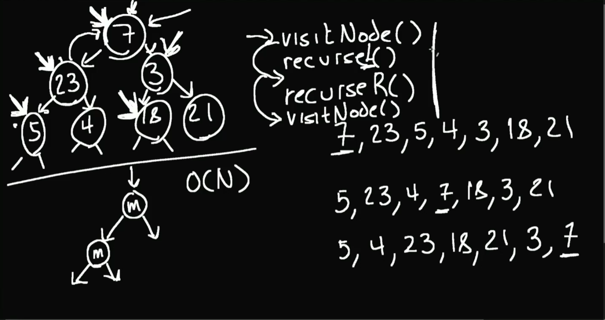
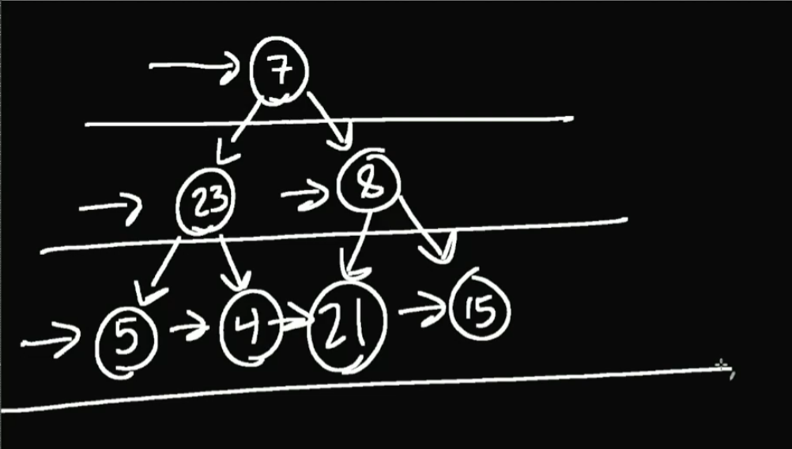
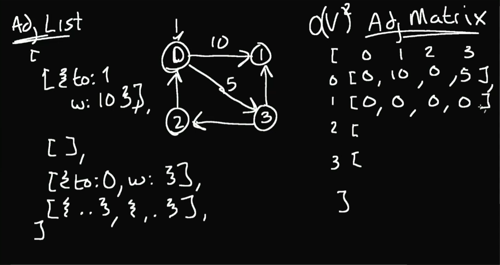

# DataStructures

* ## **Linked List**
	Series of objects. Each object points to the next one.
	In doubly linked list each object also point to the previous one.
	When using LinkedList recommend not traversing.
	Because O(n)
	Every single LinkedList is a Graph, Tree.

* ## **Queue**
	Is a specific implementation of a LinkedList. FIFO
	You always insert at the end and pop from the beginning.
	Pushing and popping is constant O(1).

* ## **Stack**
	Same as Queue only backwards. FILO

* ## **ArrayBuffer (RingBuffer)**
	Data structure if you want to remove from the head or tail and at the same time get a specific index

* ## **Tree**
	Root - the first node
	Height - The longest path from the root to the most child node
	Binary tree - a tree which has at most 2 children, at least 0 children
	General tree - a tree with 0 or more children
	Binary search tree - a tree in which has a specific ordering to the nodes and at most 2 children
	Leaves - a node without children
	Balanced - a tree is perfectly balanced when any node's left and right children have the same height
	Branching factor - the amount of children a tree has

	Tree traversel:
	There is pre order, in order, post order.
	

* ## **Breadth first search**
	Is a opposite of a depth first search.
	It visits a tree level at a time.
	

* ## **Comparing two binary trees**
	Depth first search preserves shape. While Breath first search doesn't.
	That is why we use depth first search.

* ## **Binary Search Tree**
	There is one rule that has to be applied at every node.
	The rule is that left has to be less or equal to the parent node and the right side has to be bigger then the parent node.
	O(log(n))

* ## **Heap (Priority Queue)**
	It is a binary tree where every child and grand child is smaller (MaxHeap) or
	Larger (MinHeap) then the current node.
	Whenever a node is added we must adjust the tree.
	Whenever a node is removed we must adjust the tree.
	There is no traversing the tree

	Heap is always a complete tree. Every single node is filled from left to right. There is no empty space.
	O(log(N))

* ## **Tries**
	The easiest way to visualize a trie is to think of auto-complete.
	In a trie, each node in the tree represents a single character of a string. 
	The root node represents an empty string, and the child nodes represent characters that can follow the characters represented by their parent node. 
	Each node may have multiple children, corresponding to the possible next characters in the strings that are stored in the trie.

	O(L), where L is the length of the string being searched, inserted, or deleted.

* ## **Graph**
	Is a series of nodes with some amount of connections.
	Graph Terminology:
	Cycle - when you start at Node(x) and follow the links and end back at Node(x). At least 3 Nodes
	Acyclic - A graph that contains no cycles
	Connected - When every node has a path to another node
	Directed -  When there is a direction to the connections. Thinks Twitter
	Undirected - !directed. Think Facebook
	Weighted - The edges have a weight associated with them. Think Maps
	Dag - Directed, acyclic graph.

	Implementation Terms
	Node - a point or vertex on the graph
	Edge - The connection between two nodes

	Big O
	Big O is commonly stated in terms of V and E where V stands for vertices and E stands for edges
	So O(V * E) means that we will  check every vertex, and on every vertex we check every edge

	Two ways graphs are implemented
	Adjacency list - is mostly used less memory. It is array of arrays
	Adjecency Matrix - but matrix takes large amount of memory and big O(V^2)
	

* ## **LRU Cache**
	Stands for Least recently used.
	It is a mechanism where we evict the least recently used from the cache.
	The cache uses two data structures:
	LinkedList and Hashtable
	When a value is used it is moved to the front of the list.
	When a new value is added and the cache is over capacity the least used value is removed from the cache
	O(1)
